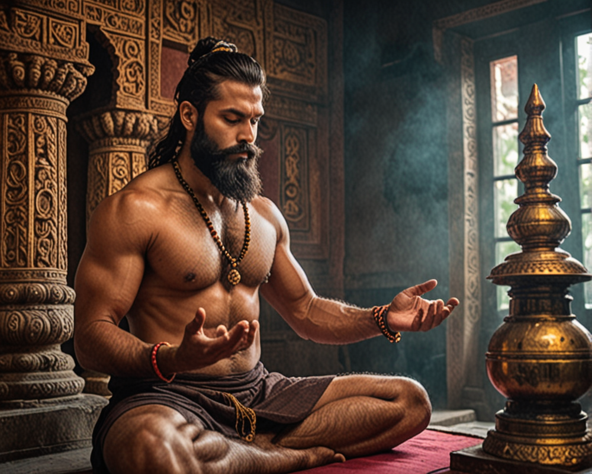

# <center>Stable Diffusion</center>
## <center>Text to Image</center>


## <center>Generated Images Sample</center>

### Image 1 
prompt: a pootrait photo of bearded muscular man worshiping shivling in temple,vibrant colors,soft lighting, high definition



### Image 2

prompt: portrait photo of muscular bearded guy in a worn mech suit, sharp focus, soft lighting, vibrant colors


### Image 3

prompt: photo of a man riding a dirt bike in forest, vibrant colors, soft lighting


---

# Stable Diffusion and DreamShaper XL - Text to Image Generation

## Overview

This repository contains Python code for generating realistic images from textual prompts using two different models: Stable Diffusion and DreamShaper XL. Stable Diffusion focuses on stable image generation through diffusion models, while DreamShaper XL specializes in realistic image synthesis.

## Requirements

Ensure you have the necessary dependencies installed by running:

```bash
!pip install diffusers["torch"] transformers
!pip install accelerate
!pip install git+https://github.com/huggingface/diffusers
```

## Stable Diffusion
### Stable Diffusion Pipeline

To use the Stable Diffusion model, follow these steps:

1. Install the required libraries.
2. Import the necessary modules.
3. Load the Stable Diffusion Pipeline from the pretrained model.
4. Define prompts and parameters.
5. Generate images using the specified prompts.

```bash

from diffusers import StableDiffusionPipeline


pipe = StableDiffusionPipeline.from_pretrained("runwayml/stable-diffusion-v1-5", torch_dtype=torch.float16)
pipe = pipe.to("cuda")

prompt = "a photo of an astronaut riding a horse on mars"
h = 800
w = 640
steps = 25
guidance = 7.5
neg = "... (negative prompts)"

image = pipe(prompt, height=h, width=w, num_inference_steps=steps, negative_prompt=neg).images[0]
```

## DreamShaper XL
### AutoPipelineForText2Image

To use the DreamShaper XL model, follow these steps:

1. Install the required libraries.
2. Import the necessary modules.
3. Load the AutoPipelineForText2Image from the pretrained model.
4. Define prompts and parameters.
5. Generate images using the specified prompts.

```bash
from diffusers import AutoPipelineForText2Image, DPMSolverMultistepScheduler
import torch


pipe = AutoPipelineForText2Image.from_pretrained('lykon/dreamshaper-xl-v2-turbo', torch_dtype=torch.float16, variant="fp16")
pipe.scheduler = DPMSolverMultistepScheduler.from_config(pipe.scheduler.config)
pipe = pipe.to("cuda")

prompt = "portrait photo of muscular bearded guy in a worn mech suit, light bokeh, intricate, steel metal, elegant, sharp focus, soft lighting, vibrant colors"

generator = torch.manual_seed(0)
image = pipe(prompt, num_inference_steps=6, guidance_scale=2).images[0]

```


## GitHub Repository Pull Request
If you have any improvements or suggestions, feel free to submit a pull request. Follow these steps:

1. Fork the repository to your GitHub account.
2. Clone the forked repository to your local machine.
3. Create a new branch for your changes.
4. Make your modifications and commit them.
5. Push the changes to your forked repository.
6. Open a pull request from your branch to the original repository.

I appreciate your contributions and welcome any feedback or enhancements to the code.
